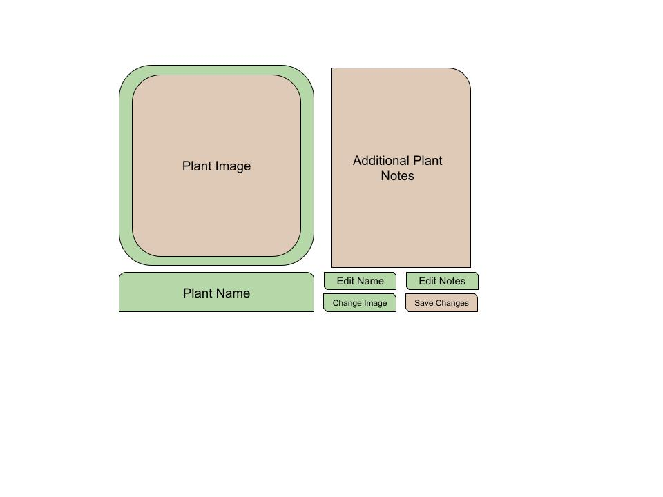

# Project Inception
*Group 2 - "[Plant Pals]"
Group Members: Haley Berger, Haley Kloss, Alex King, Andrew Ortega, Karissa Smallwood, Alyssa Ortega

## 1) Positioning:

### 1.1 Problem Statement
The problem of lack of community and information in houseplant ownership affects plant owners; the impact of which is isolation and ineffective plant care that results in plants dying preventable deaths.

### 1.2 Product Position Statement
For plant owners who want to connect with a community and get help with plant care, Plant Pals is a website that connects the plant community and offers reliable insights into plant care; unlike OurHousePlants.com, our product does not fully rely on a preset FAQ and allows plant owners to interact with one another, providing answers to specific questions alongside general plant information.

### 1.3 Value Proposition and Customer Segment
**Value proposition:** Plant Pals helps plant owners grow (and not kill their plants) by providing information and a community that gives everyone a green thumb!

**Consumer Segment:** Plant Pals is for anyone who has a houseplant, from beginners to experts, who wants to get involved with a plant-loving community and have reliable information to help plants thrive.

## 2) Stakeholders:
**Plant Owners** - Plant owners who make an account with Plant Pals
Will visit and utilize the website so that it is successful and they may continue to use it. Will also add to discussion boards to build and be part of a thriving community. 

**Competitors** - Other websites focused on plant care information and communities
Will maintain a clean competitive environment and high-quality products to build and maintain interest in such resources.

**Developers** - The team making and maintaining the website 
Provide a functional, accurate website to draw in users and grow public interest.

**Database Managers** - Those keeping the database up to date and organized
Ensure that the data is correct, up to date, and input correctly so that the website is able to run smoothly.

**Browsers** - People surfing the web looking for information without signing in
Increase traffic to the website so that it continues to be successful enough to remain live for them to look at.

## 3) Functional Requirements (features):
1. Create accounts with unique usernames and passwords.
2. Email verification for account activation.
3. Password recovery system.
4. Create new discussion posts with titles and content
5. Reply to existing posts.
6. Allow users to edit and delete their own posts.
7. View discussion boards/replies.
8. Create a private plant portfolio and add plant details, including names and images to it.
9. Create a plant watering schedule.
11. Allow users to edit or delete plants from their portfolio.
12. Accurate plant information database.
13. Search feature for the plant information.
14. Notification system for replies on posts and watering schedule.
15. Security features such as password encryption.
16. UI to easily navigate the website.
17. Moderation tools.
18. Feedback/ report bugs
19. Follow others - ‘friending/pals’

## 4) Non-functional Requirements:
1) Speed, with fast data retrieval, so that users do not give up waiting and click to another page (sub 5 seconds)
2) Security of passwords and sensitive profile information, so that accounts cannot easily be hacked (no security breaches within the first month of deployment)
3) Reliability of function, so that if a person post, searches, or follows, they can be confident that it will go through as intended (less than 1% of users submitting bug reports on these functions in the first month)
4) Ease of use of user interface, so that users can quickly and intuitively use the website (new users are able to use all major features within an hour of making an account)
5) Scalability of the database and user base, so that more people can join over time and more plants can be added to the database (after one year live people can continue to join the site and the database has at least grown by 1.5x)
6) Accessibility, making it so the visually impaired can still use the site and read the key information  (if possible, implement text to speech, and have visually impaired test users to try out the site)
7) Compatibility with multiple types of devices using dynamic web page design (test the main pages on multiple sizes and types of devices)

## 5) MVP:
The Minimum Viable Product for Plant Pals is user profiles with a personal plant portfolio, a plant discussion board, and a functional and informative plant database. The priority is to allow users to make accounts and ask questions on a public forum. They should also be able to add plants to their profile as well as include a watering schedule. This would require account validation, a clear interface, and secure user storage. To test this, we could create test accounts and post discussion forum posts, reply to the posts, and add a plant to our profile. In other words, it would be implemented and then prototyped for functionality. Discussion forums and user profiles aside, users should be able to look up plants and find the exact information they need to successfully care for it. This would require a fast retrieval time for the information (under 5 seconds), a clear user interface and display, and the correct information associated with each label. It would also be beneficial for the search engine to be able to handle spelling errors and extraneous wording. To test this, we would need to test the database’s response to multiple inputs and types of input. We could start by using the Wizard of Woz method to make sure the website could accurately take in information and connect it to the database at the beginning, without the more complex functionalities of retrieval. The site would also need to be resistant to attacks from hackers using SQL injection attacks. To ensure security in this aspect, we would need to test by trying to hack our database.

## 6) Use Cases:
### 6.1 Use Case Diagram

### 6.2 Use Case Description
**Use Case #1**: Edit Plant Portfolio/Profile
Actor: User
Trigger: Goes to profile page
Pre-conditions: Must be logged in
Post-condition: The information is updated
Success Scenario: The user edits the plant name and plant picture
- User attempts to access their private profile
- System takes user to their profile
- The user adds a new plant picture and plant information
- The user saves and the new information and picture
- The system updates the users plant portfolio
- The user has an updated portfolio

Alternate Scenario #1: The user only edits the plant name successfully
- User attempts to access their private profile
- System takes user to their profile
- The user adds a new plant information (name)
- The user saves and the new information
- The system updates the users plant portfolio
- The user has an updated portfolio

Alternate Scenario #2: The user edits only the plant picture successfully
- User attempts to access their private profile
- System takes user to their profile
- The user adds a new plant picture
- The user saves the new plant picture
- The system updates the user's plant portfolio
- The user has an updated portfolio

Alternate Scenario #3: The user fails to edit the plant information
- User attempts to access their private profile
- The user is not logged in
- The system does not allow the user to access the profile page

**Use Case #2**: Comment on Discussion Boards
Actor: User
Trigger: Goes to Discussion Board Page
Pre-conditions: Must be logged in to post/comment
Post-condition: The discussion board has a new post/thread

Success Scenario: The user replies to a comment
- User logs into their account
- User navigates to the discussion board
- User navigates to a post
- User looks at post comments
- User replies to a comment
- The system adds the reply to the discussion board
- The reply is visible to other users

Alternate Scenario #1: The user comments on a post
- User logs into their account
- User navigates to the discussion board
- User sees a post
- User drafts comment
- User posts comment
- The system adds the comment to the post 
- The comment is visible to people viewing the post

Alternate Scenario #3: An unregistered user tries to respond
- A user navigates to the discussion board
- The user is not logged in
- The user tries to post a reply to the board
- The system does not allow the user to make a post
- The system asks user to sign in

**Use Case #3**: Create Discussion Post
Actor: User
Trigger: Goes to Discussion page 
Pre-conditions: Must be logged in
Post-condition: The user created a post

Success Scenario: The user creates and posts a discussion board to the page.
- User attempts to write a post
- The user adds a discussion post
- The system displays the post and tells the user that they successfully created a post
- The user can now see their pos t in the forum
- The user has created a post

Alternate Scenario #1: The user fails to create a post
- User attempts to write a post
- System asks them to login
- The user does not have an account
- The system doesn’t allow for the user to create a new discussion post

Alternate Scenario #2: User creates multiple posts
- User attempts to write a post
- The user adds a discussion post
- The system displays the post and tells the user that they successfully created a post
- The user can now see their post in the forum
- The user adds another discussion post
- The system displays the post and tells the user that they successfully created a post
- The user has created multiple posts

**Use Case #4**: Sign-in
Actor: User
Trigger: Signs into account 
Pre-conditions: the user has access to the website
Post-condition: the user signs in or makes account

Success Scenario: The user signs into the website 
- The user enters email
- The user enters password
- The user clicks submit button
- The system verifies the password and username match
- The user successfully signs in

Alternate Scenario #1: User cannot log in
- The user enters email address
- The user enters password
- The user clicks submit
- The system verifies the password and username match, and rejects the password and username
- The user can reattempt log-in until correct

Alternate Scenario #2: User does not have an account
- The user clicks the sign up button
- The user enters desired email address
- The user enters desired password
- The user clicks submit
- The user is now able to sign into their account

**Use Case #5**: User searches for plant
Actor: User
Trigger: Enters text into search box
Pre-conditions: The user has access to the website
Post-condition: The user receives a page full of similarly named plants

Success scenario: The user searches for a plant
- The user searches for plant information
- The system shows the most relevant results
- The user selects the plant they were searching for
- The user gets the information they want

Alternate scenario #1: The user does not have access to the internet
- The user cannot get a connection to the server
- The user attempts to reconnect to the internet or moves to a location with internet access
- The user gets the information they want

Alternate scenario #2: The user does not know the name of the plant
- The user will have to rely on external tools to find the name of the plant
- The user searches for the plant
- The user gets the information they want

**Use Case #6**: Edit User Profile
Actor: User
Trigger: selects edit profile button
Pre-conditions: Must be logged in
Post-condition: The user information is updated

Success Scenario: The user edits their information
- User attempts to edit their profile
- System takes user to edit profile page
- The user changes information in their profile
- The user saves the new information
- The system updates the user's profile information
- The user has an updated profile

Alternate Scenario #1: The user edits their profile information but does not save changes
- User attempts to edit their profile
- System takes user to edit profile page
- The user changes information in their profile
- The user does not save the new information
- The system loads the user's previous profile information
- The user does not have an updated profile

In addition to this, we have also settled on a hex code color palette we will be using. This is going to be done for cohesion as is as follows:
#1F6321  / #69A743 / #E9FEBA / #F2D79C / #E9BF61 / #A75E0D / #80480A / #603608
We understand that the current diagrams do not match this, but in production, they will.

## 7) User Stories:

As a novice plant owner, I want to search for information about plant care so that I can keep my plants alive. (Priority level: 1 Hours: 6)
As a community member, I want to post to a discussion so that I can ask questions to more experienced gardeners. (Priority level: 2 Hours: 4)
As a new account holder, I want to easily make my profile so that I can document my plants. (Priority level: 13 Hours: 7)
As a frequent website visitor, I want to friend other users so that I can keep up with others in my community. (Priority level: 233 Hours: 9)
As an experienced gardener, I want to find and respond to discussions so that I can help people get into plant owning. (Priority level: 8 Hours: 2)
As a casual browser, I want to search for information without signing in so I can decide whether or not I want to make an account. (Priority level: 3 Hours: 2)
As an older person without much technological savvy, I want to be able to navigate around the website easily so that I can do what I need to without getting confused. (Priority level: 21 Hours: 3)
As an admin, I want to be able to easily moderate so that the website stays informative, helpful, and good-natured. (Priority level: 5 Hours: 5)
As a database manager, I want to be able to add/remove/edit plants so that information stays up-to-date and is easily manageable. (Priority level: 34 Hours: 2)
As a new account holder, I want to save my plants so that I can take better care of my plants. (Priority level: 55 Hours: 4)
As an experienced gardener, I want the ability to put in a request if data is wrong so that there is always accurate information available. (Priority level: 144 Hours: 2)
As a long term account holder, I want to be able to edit my information so that I can keep my account up to date. (Priority level: 89 Hours: 3)

## 8) Issue Tracker:
