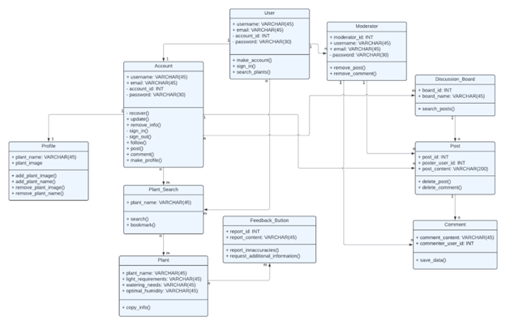

# D.3 Analysis

## **1. System Description**

Owning a houseplant can be a daunting task for those who are not confident in their plant care abilities, and who are unsure of how to effectively care for their leafy companions. This has created the problem of a lack of community and information on how houseplant ownership affects plant owners. The impact of this is isolation and ineffective plant care that results in plants dying and preventable deaths. A service like Plant Pals can resolve these issues of plant mismanagement and preserve plant life! This is an issue that can be solved with a service like Plant Pals! For plant owners who want to connect with a community and get help with plant care, Plant Pals is a website that connects the plant community and offers reliable insights into plant care. Unlike OurHousePlants.com, our product does not fully rely on a pre-set FAQ and allows plant owners to interact with one another. Whereas a lot of available resources are detached, and have extraneous, confusing information, Plant Pals works to ensure that plant care is accessible to all. Plant Pals helps plant owners grow (and not kill their plants) by providing information and a community that gives everyone a green thumb!

The Plant Pals website will be centered around three key functionalities: **profiles**, a **plant database**, and **user** **discussion boards**. When **users** **_make_** an **account** with the website, they will create a unique _username_ and _password_. Once this is completed, they can then activate their **account** by verifying it with their _email_. The website will also include a **password recovery system**, in case the **user** forgets and wants to log back in. On an **account**, a **user** can **_create_** a **profile** of their _plants_ with _names_ and _pictures_ of each. All of these pieces of information can be **_changed, updated, or removed later_** as long as the **user** is signed in. This _information_ must also be secure, as it includes _personal details_. A **user** can also create a _plant watering schedule_ if desired. Plant Pals may also include a **_follow_**, or ‘**_Pal_**’, feature. 

The **plant database** is an essential feature of the Plant Pals website. The **database** will contain the _essential information_ on how to care for your _plants_, such as _light requirements_, _watering needs_, and _optimal humidity levels_. This data is **_searchable_** with an _easy-to-use_ **_search engine_** that **_provides_** accurate information. There is a **feedback feature** to **_report inaccuracies_** or **_request additional information_** be added. A user can access the **search engine** whether or not they are signed into an **account.** 

**Discussion boards** are a standout feature of the website, allowing **users** to build a community. Signed-in **users** can make **dashboards** for broad subjects. On these **dashboards**, these users can also make **posts** asking _questions_, _giving plant updates_, or _sharing information_. **Posts** have **comments** sections, where logged-in **users** can make **comments** about the **post** or even other **comments** with _answers_, _further questions_, or other _contributions_. A **user** who is not logged in cannot interact with a dashboard, but can **_observe_** it. These dashboards must be **_monitored_** by logged in **moderators** who can **_take down_** **comments** and **posts** that are not consistent with the values of the website. The **dashboards** as a whole provide a way for users to correspond with others who have similar interests to share valuable information and support. 

## **2. Model**

