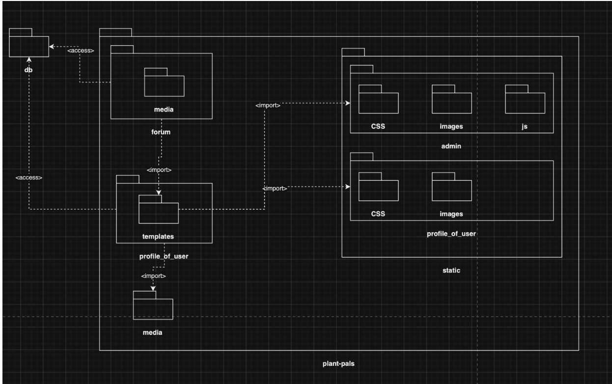
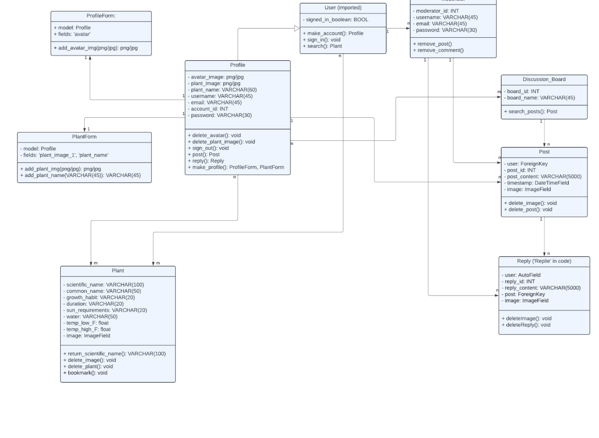
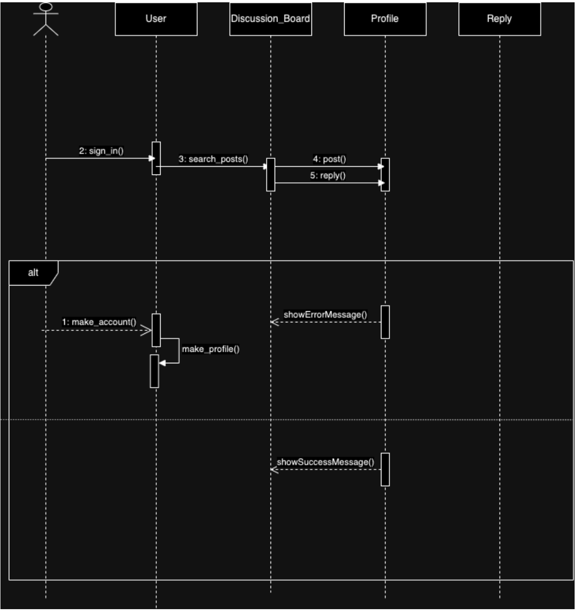
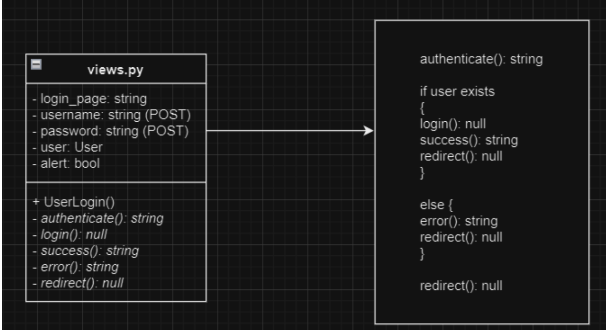
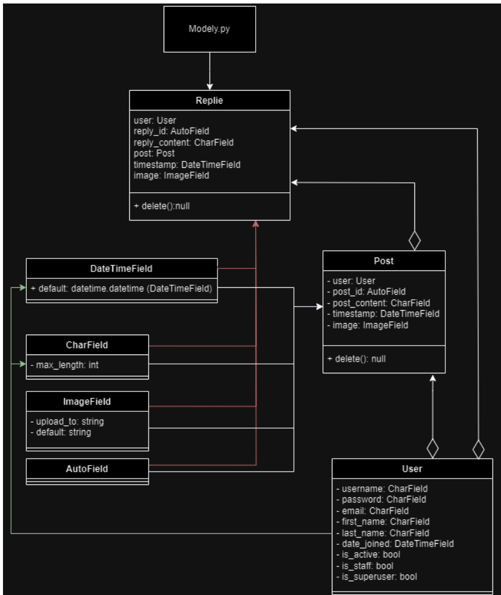

# D.5 Design

---

## **1\. Description**

The Plant Pals website will be centered around three key functionalities: profiles, a plant database, and user discussion boards. When users make an account with the website, they will create a unique username and password. Once this is completed, they can then activate their account by verifying it with their email. The website will also include a password recovery system, in case the user forgets their password and wants to log back in. On an account, a user can create a profile of their plants with names and pictures of each. All of these pieces of information can be changed, updated, or removed later as long as the user is signed in. This information must also be secure, as it includes personal details. A user can also create a plant watering schedule if desired. Plant Pals may also include a follow, or 'Pal', feature. The plant database is an essential feature of the Plant Pals website. The database will contain the essential information on how to care for your plants, such as light requirements, watering needs, and optimal humidity levels. This data is searchable with an easy-to-use search engine that provides accurate information. There is a feedback feature to report inaccuracies or request additional information be added. A user can access the search engine whether or not they are signed into an account. 

Discussion boards are a standout feature of the website, allowing users to build a community. Signed-in users can make dashboards for broad subjects. On these dashboards, these users can also make posts asking questions, giving plant updates, or sharing information. Posts have comments sections, where logged-in users can make comments about the post or even other comments with answers, further questions, or other contributions. A user who is not logged in cannot interact with a dashboard, but can observe it. These dashboards must be monitored by logged in moderators who can take down comments and posts that are not consistent with the values of the website. The dashboards as a whole provide a way for users to correspond with others who have similar interests to share valuable information and support.

## **2\. Architecture**

We have a single database where everything is stored. This holds user profiles info, discussion board info, and plant database info. A template folder holds all of our HTML files which then connect to designated CSS files and Javascript files. An image folder is also associated in order to keep images properly organized. Some of these are split up into a separate folder titled "static" which is then split between two sub-folders, admin and profile_of_users. Admin relates the Django admin page and profile_of_user related to our users specific profiles. We do not make direct edits to these files. The ones that are not static are the files we do make changes to; this includes the templates folder as we might add new visible features to our website through HTML as well as another image folder that does have pictures that constantly get added to, unlike the ones in the static folder that do not and are not supposed to be changed.

## **3\. Class diagram**

## **4\. Sequence diagram**

Use Case: Comment on Discussion Boards\
Actor: User\
Trigger: Goes to Discussion Board Page\
Pre-conditions: Must be logged in to post/comment\
Post-condition: The discussion board has a new post/thread

Scenario: The user comments on a post

-   User successfully logs into their account

-   User navigates to discussion board

-   User sees a post

-   User drafts comment

-   User posts comment

-   The system adds the comment to the post 

-   The comment is visible to people viewing the post

Alternate Scenario: An unregistered user tries to respond

-   A user navigates to the discussion board

-   The user is not logged in

-   The user tries to post a reply to the board

-   System does not allow the user to make a post

-   System asks user to sign in

## **5\. Design Patterns**

Login Structure - Behavioral (Template):
<https://github.com/ao994/plant-pals/blob/main/Code/plant-pals/profile_of_user/views.py>

Discussion Board Reply Structure - Structural (Composite): 
<https://github.com/ao994/plant-pals/blob/main/Code/plant-pals/profile_of_user/models.py>

Reply has two composites: Post and User. It also has four leaves: DateTimeField, CharField, ImageField, and AutoField. 

Post has one composite: User. It has four leaves as well:  DateTimeField, CharField, ImageField, and AutoField. 

User has two leaves: DateTimeField and CharField.

## **6\. Design Principles**

The first SOLID Principle is the Single-responsibility Principle, which states that a class should only have one job.

-   The classes in our program are designed to serve only a single purpose.  One example of this is the Plant class, as defined in models.py. This class holds all of the information needed to describe a plant and nothing else.  It is only in the plant search engine, which allows users to find information about plants and how they should be cared for. In this way, the Plant class only has one job: to hold information about the plants.

The second SOLID Principle is the Open-closed Principle, which states that objects and entities can be extended but not modified (open to extension, closed to modification).

- The Plant class has all data fields present as a template. The database then uses that template for each new plant object to be added. If needed, we could easily make a subclass that extends the plant class for specific types of plants that require additional information, which add new fields to the templates. This would extend but not modify the class plant.

The third SOLID Principle is the Liskov Substitution Principle, which states that a subclass has all the properties of its parent class (you could substitute a subclass for its parent class).

- The Liskov Substitution Principle is not currently implemented in our website, as we do not yet have any subclasses. One subclass we may implement in the future is a subclass of Replie for AdminReplie. This would be the same as Replie, except it would only be viewable by certain people with the correct permissions. This subclass would have the same return as its superclass, and could easily be swapped into any situation where the superclass was used. 

The fourth SOLID Principle is the Interface Segregation Principle, which states that there should be no unnecessary dependencies, where clients are forced to connect to interfaces/functions they don't use.

-   The web framework we are using (Django) has a special HTML field where we can check if a user is authenticated. If they are authenticated, then the framework will populate a post button on the Discussion page, allowing the user to post. They are then required to fill out the post text fields to fulfill all of the requirements in our post data model before the framework will allow them to submit the post. Otherwise, the user will be asked to authenticate before they can attempt to post. In this way, the post interface is not connected to clients when they cannot use it, removing this unnecessary dependency. 

The final SOLID Principle is the Dependency Inversion Principle, which states that a developer should make the low level code as separate from the high level code as possible so if they change the low level code, the high level code can still be easily 'plugged in'.

-   One example of abstracting low level code to separate it from the high level code is the models.py file the Django web framework uses, which abstracts database fields into python objects. This makes them easier to access in other areas of the codebase, and allows for separation from how the database engine works, allowing the high level code to be "plugged in" even if the database somehow changes.
